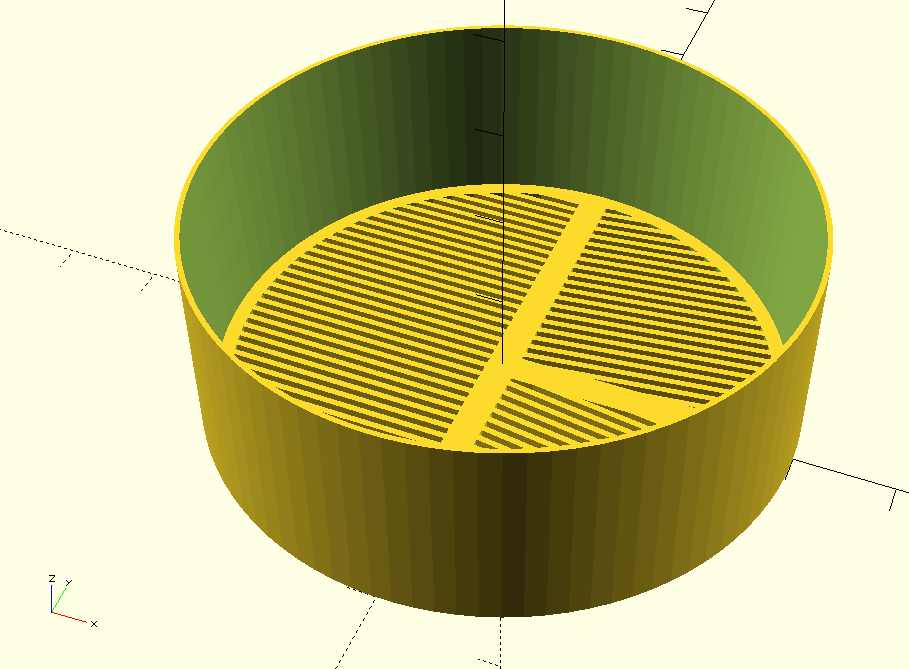
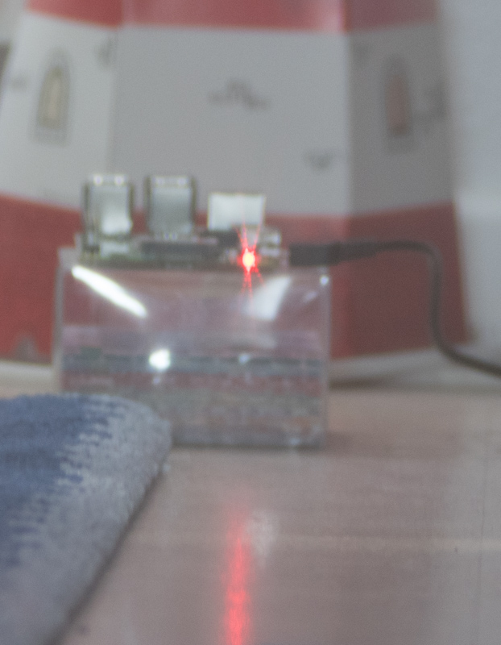
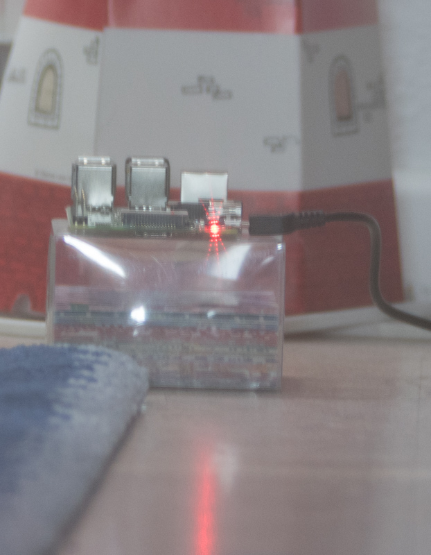
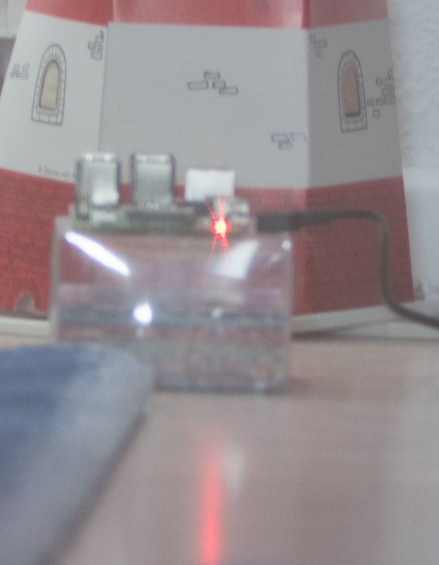

# Bahtinov Mask Generator for OpenSCAD

This is a SCAD generator for [Bahtinov masks](https://en.wikipedia.org/wiki/Bahtinov_mask). 
Such a mask is used as a focusing help for small telescopes. An example mask looks like this:

The [Generator](bahtinov.scad) allows one to generate a focusing mask for small aperture 
telescopes, i.e. as large as your build volume permits. 

If a point source is imaged with this mask, i.e. you put the mask in front of your telescope, 
it will display an interference pattern for bright sources, that allows to focus the telescope correctly.

For example, using such a mask in front of a 400 mm telescope and imaging a red LED from a Raspberry PI, 
you can see the correct focus position from the patterns generated by the mask: 

  

From left to right (click to enlarge): As you can see, if the focus is before the point source (on the carpet), 
the interference pattern generated is asymmetric. If the focus position is at the point source, the pattern is symmetric. 
If the focus is behind the point source (on the lighthouse model), the pattern is again asymmetric. Using the interference 
pattern you can set the focus correctly to the plane of the source. 

# How to use the Generator

[Download the generator to your computer](bahtinov.scad) and open it in SCAD.
Go through the document and set the parameters as you see fit. Then render the mask using F6, when you are 
satisfied, export the STL and print.

